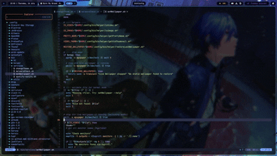

My beloved Arch + Hyprland Dotfiles :)  
Every config and bash script I wrote myself so do not expect professional things here xD

Take a lock and feel free to use what you like :)

Side-Note: Everything you see in the Screenshots below changes according to the choosen theme. I just don't show it in the gif down below due to filesizes...

  <h1><strong> 📷 Screenshots </strong>
    
  </h1>

### SDDM

### Lockscreen  

### Desktop  

### Runner / Notification Center

### Theme-Switcher

### Wallpaper-Switcher

